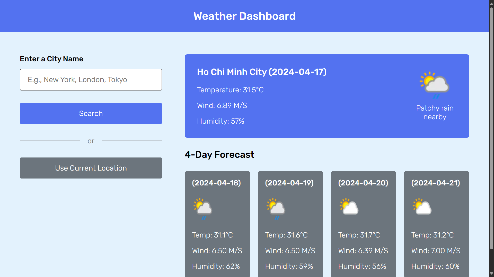

# Weather Forecast Dashboard
In this assignment, I used HTML, CSS and Javascript for Frontend and Node.js for Backend. This is a picture about my simple website.

# How to run project locally
We will run for Frontend and Backend so that we can search the weather of a city. All of them will be executed on VSCode.

## Frontend
1. Install `Live Server` extension.
2. Open file `index.html` in `web` folder.
3. Click on `Go Live` button in the lower right corner of the screen.
4. The browser will open a website. This is your frontend design.
5. If you want to connect to the server by local host, you can go to `resources/js/weather.js` and assign the `baseURL` to `http://localhost:3000/` 

## Backend
1. Install `Node.js`.
2. Open terminal and install `express` by the line `npm install --save express`
3. Run server by the line `cd server | node server.js` for the first time. The next time, you only need to enter `node server.js` if you want to run server again.

## Demo link
* Frontend: https://go-intern-assignment.vercel.app/
* Backend: https://go-intern-assignment.onrender.com/
